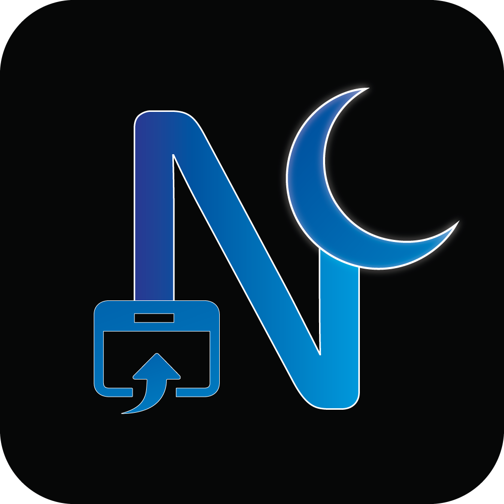

  

<h1 align="center">Noirly — Soft Blue Dark Mode</h1>

  Soft Blue Premium Dark Mode for modern browsing.

  

# Noirly — Soft Blue Dark Mode

Noirly transforms light websites into a smooth, premium dark experience designed for comfort and clarity.

## ✨ Features

- Soft Blue Premium, Matte Premium, and OLED Black modes
- Automatically skips websites that already use a dark interface
- Improves text readability
- Lightweight and fast

## 🛡 Privacy

Noirly does not collect, store, or transmit any user data.

All functionality runs locally in the browser.  
Settings are saved locally using the browser storage API.

## 🌐 Official Release

Firefox Add-ons:
https://addons.mozilla.org/addon/noirly-soft-blue-dark-mode/

Developer Website:
https://animatorpark.com

## 📦 Manual Installation

Users can download the source code and load it as a temporary extension in Firefox or Chrome developer mode.

## 📜 License

MIT License
